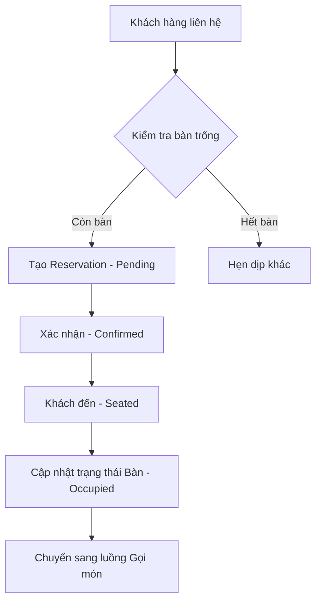
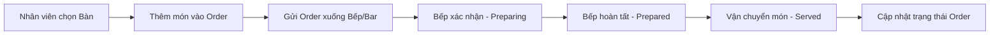
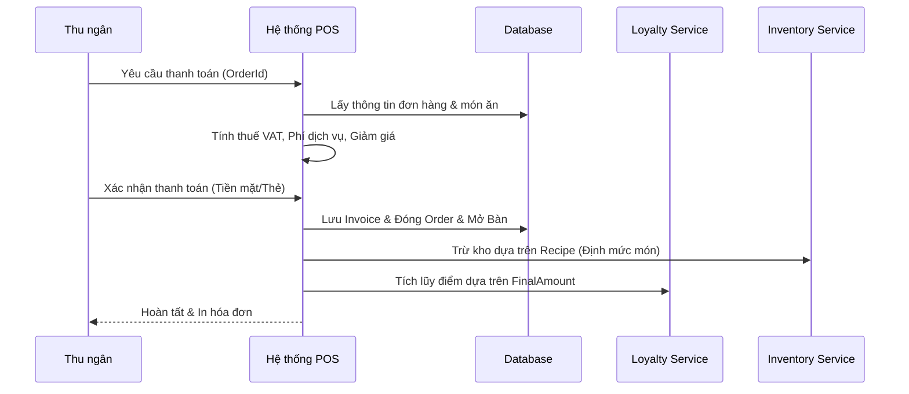

# BÁO CÁO PHÂN TÍCH HỆ THỐNG QUẢN TRỊ NHÀ HÀNG (VIP RESTAURANT CRM)

## 1. Giới thiệu dự án
**Dự án:** VIP Restaurant CRM Management System
**Mục tiêu:** Xây dựng một nền tảng quản trị tổng thể cho các nhà hàng cao cấp, tập trung vào việc tối ưu hóa trải nghiệm khách hàng (CRM), quản lý vận hành (đặt bàn, gọi món, kho) và báo cáo doanh thu thông minh.

Hệ thống được thiết kế theo mô hình **Client-Server**, tách biệt giữa Backend (API) và Frontend (Dashboard), đảm bảo tính bảo mật và khả năng mở rộng.

---

## 2. Công nghệ sử dụng (Technology Stack)

### 2.1 Backend (Server-side)
- **Framework:** .NET 8 Web API (phiên bản ổn định nhất của Microsoft).
- **ORM:** Entity Framework Core 8 (quản lý Database thông qua Code-first).
- **Database:** PostgreSQL (Hệ quản trị cơ sở dữ liệu quan hệ mã nguồn mở mạnh mẽ).
- **Authentication:** JWT Bearer Token (Xác thực người dùng qua token không trạng thái).
- **Real-time:** SignalR (Cập nhật trạng thái bàn và bếp tức thời).
- **Messaging:** IMessageQueue (Xử lý hàng đợi tin nhắn marketing).
- **Documentation:** Swagger UI (Tự động tạo tài liệu API).

### 2.2 Frontend (Client-side)
- **Framework:** Next.js 15+ (React framework với tính năng Server Components).
- **Styling:** Tailwind CSS 4 (Tối ưu hóa giao diện hiện đại và responsive).
- **State Management:** Zustand (Quản lý trạng thái toàn cục gọn nhẹ).
- **Data Fetching:** TanStack Query v5 (React Query) giúp quản lý cache và đồng bộ dữ liệu.
- **Form Handling:** React Hook Form & Zod (Xác thực dữ liệu form mạnh mẽ).
- **Visuals:** Recharts (Hiển thị biểu đồ báo cáo) & Framer Motion (Hiệu ứng chuyển động mượt mà).
- **Icons:** Lucide React.

---

## 3. Thiết kế Cơ sở dữ liệu (Database Schema)

Hệ thống bao gồm **14 bảng chính**, được thiết kế chuẩn hoá để lưu trữ và quản lý dữ liệu.

| Tên Bảng | Ý nghĩa | Các trường quan trọng |
| :--- | :--- | :--- |
| **Users** | Quản lý nhân viên/Quản trị viên | `Username`, `PasswordHash`, `FullName`, `Role` (Admin, Staff, Cashier, Kitchen, Waiter) |
| **Customers** | Thông tin khách hàng | `PhoneNumber`, `FullName`, `Email`, `Points`, `Tier` (Member, Silver, Gold, Diamond), `Segment` |
| **DiningTables** | Quản lý sơ đồ bàn | `TableNumber`, `Capacity`, `Status` (Available, Reserved, Occupied, Cleaning) |
| **MenuCategories** | Danh mục thực đơn | `Name`, `Description` |
| **MenuItems** | Chi tiết món ăn | `Name`, `Price`, `CategoryId`, `ImageUrl` |
| **Orders** | Đơn hàng tại bàn | `DiningTableId`, `TotalAmount`, `Status` (Pending, Preparing, Served, Completed) |
| **OrderItems** | Chi tiết món ăn trong đơn | `OrderId`, `MenuItemId`, `Quantity`, `UnitPrice` |
| **Invoices** | Hóa đơn thanh toán | `OrderId`, `CustomerId`, `Subtotal`, `VatAmount`, `FinalAmount`, `PaymentMethod`, `Status` |
| **Reservations** | Đặt bàn trước | `CustomerName`, `PhoneNumber`, `ReservationDate`, `GuestCount`, `Status` |
| **LoyaltyTransactions**| Lịch sử tích điểm | `CustomerId`, `PointsEarned`, `TransactionReference` |
| **Vouchers** | Mã giảm giá | `Code`, `Value`, `DiscountType` (Percentage, Fixed), `ExpiryDate` |
| **InventoryItems** | Quản lý kho nguyên liệu | `Name`, `StockQuantity`, `Unit`, `MinStockLevel` |
| **Recipes** | Định mức món ăn | `MenuItemId`, `InventoryItemId`, `Quantity` (Để tự động trừ kho khi bán) |
| **Shifts** | Quản lý ca làm việc | `UserId`, `StartTime`, `EndTime`, `Note` |

---

## 4. Danh sách API chính (Endpoints)

Hệ thống cung cấp các API RESTful được phân loại theo Controller:

- **AuthController**: 
    - `POST /api/auth/login`: Đăng nhập hệ thống và nhận Token.
    - `POST /api/auth/register`: Đăng ký tài khoản nhân viên.
- **CustomerController**: 
    - `GET /api/customer`: Danh sách khách hàng.
    - `GET /api/customer/search`: Tìm kiếm theo số điện thoại.
- **OrderController**:
    - `POST /api/order`: Tạo đơn hàng mới tại bàn.
    - `PATCH /api/order/{id}/status`: Cập nhật trạng thái chế biến/phục vụ.
- **BillingController**:
    - `POST /api/billing/pay`: Xử lý thanh toán, xuất hóa đơn, tích lũy điểm và trừ kho.
- **InventoryController**:
    - `GET /api/inventory`: Quản lý vật tư trong kho.
- **ReportsController**:
    - `GET /api/reports/revenue-stats`: Thống kê doanh thu theo ngày.
    - `GET /api/reports/top-selling`: Top món ăn bán chạy nhất.

---

## 5. Sơ đồ luồng xử lý (Flow Diagrams)

Dưới đây là các quy trình nghiệp vụ cốt lõi của hệ thống:

### 5.1 Luồng Đặt bàn & Đón khách

### 5.2 Luồng Gọi món & Chế biến

### 5.3 Luồng Thanh toán & Tích điểm & Kho
Đây là quy trình quan trọng nhất thể hiện sự liên kết giữa các bảng:

---

## 6. Các tính năng nổi bật của dự án

1. **Quản lý CRM thông minh:** Tự động phân hạng khách hàng (Loyalty) và phân đoạn (Segment) dựa trên hành vi mua hàng.
2. **Khấu trừ kho tự động:** Khi một món ăn được thanh toán, hệ thống dựa vào bảng `Recipes` để tự động trừ số lượng nguyên liệu tương ứng trong `Inventory`.
3. **Cập nhật thời gian thực:** Sử dụng SignalR để đồng bộ trạng thái bàn giữa nhân viên phục vụ, thu ngân và bếp mà không cần tải lại trang.
4. **Hệ thống báo cáo mạnh mẽ:** Cung cấp các chỉ số quan trọng như doanh thu 7 ngày gần nhất, tỷ lệ lấp đầy bàn, món ăn bán chạy nhất hỗ trợ ra quyết định kinh doanh.
5. **Giao diện hiện đại (VIP Aesthetics):** Dashboard được thiết kế theo phong cách hiện đại, hỗ trợ Dark/Light mode, thân thiện trên cả tablet và desktop.

---
*Tài liệu này được biên soạn phục vụ mục đích báo cáo học tập và phân tích hệ thống.*
